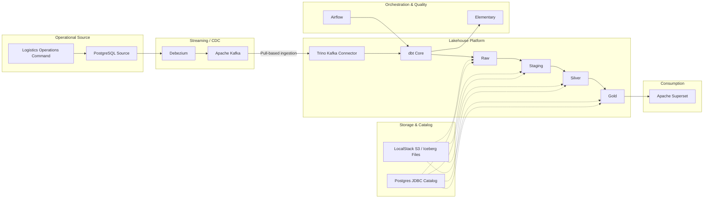
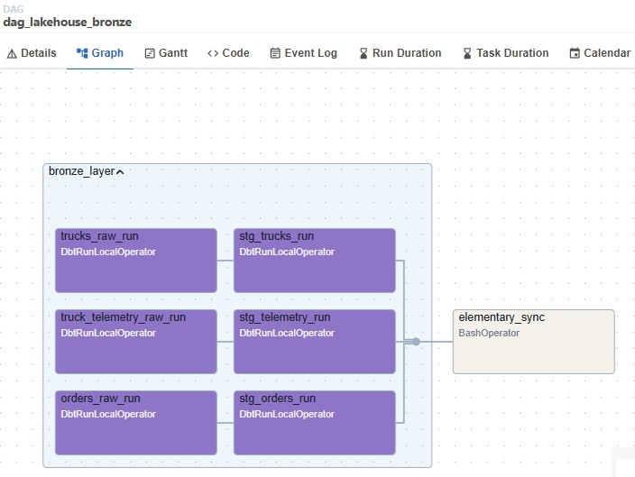
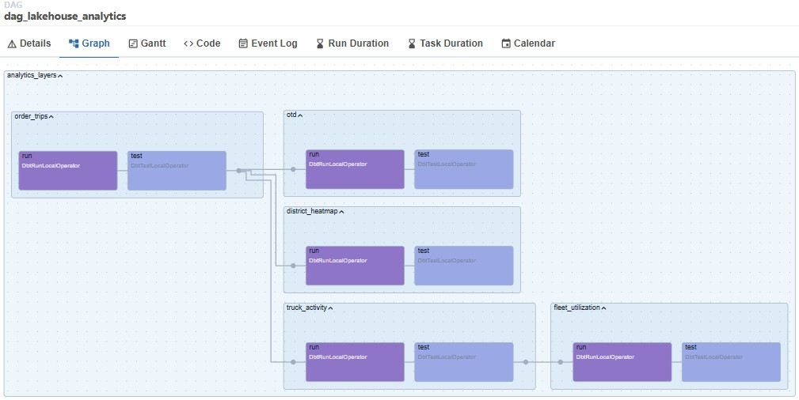
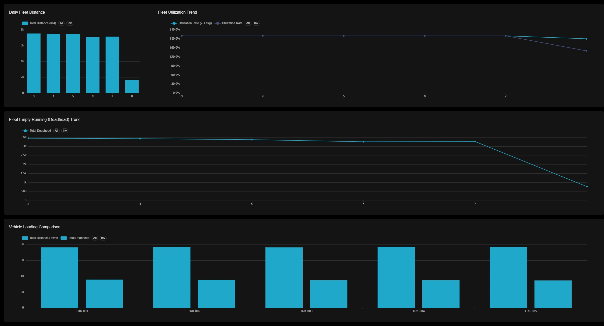
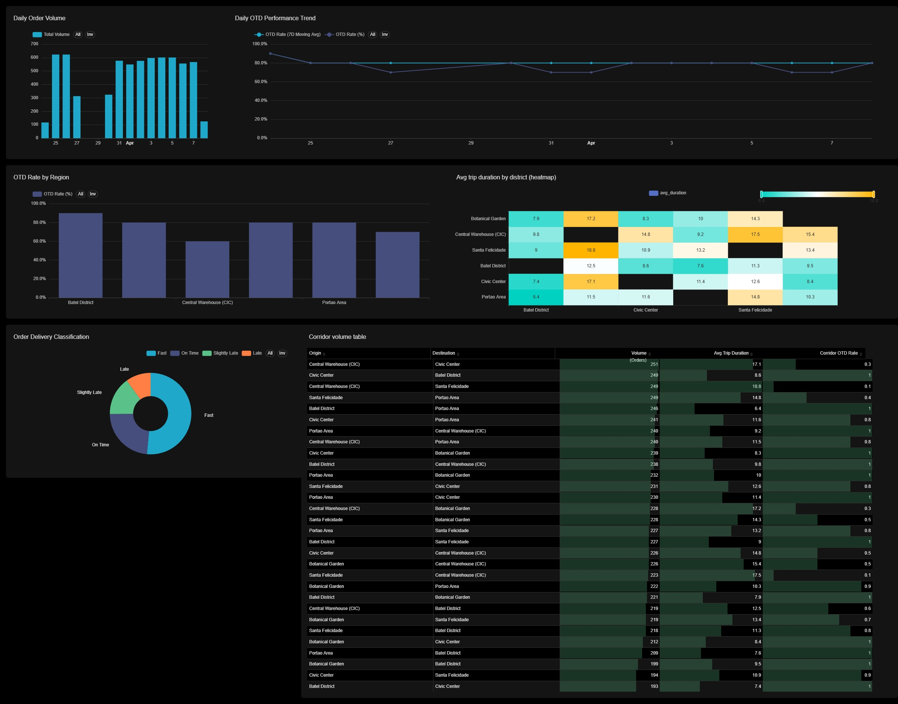
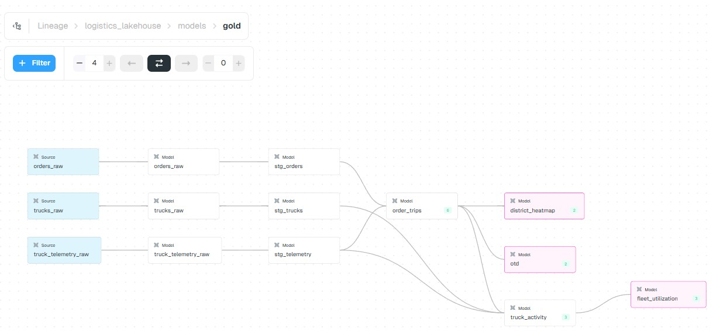
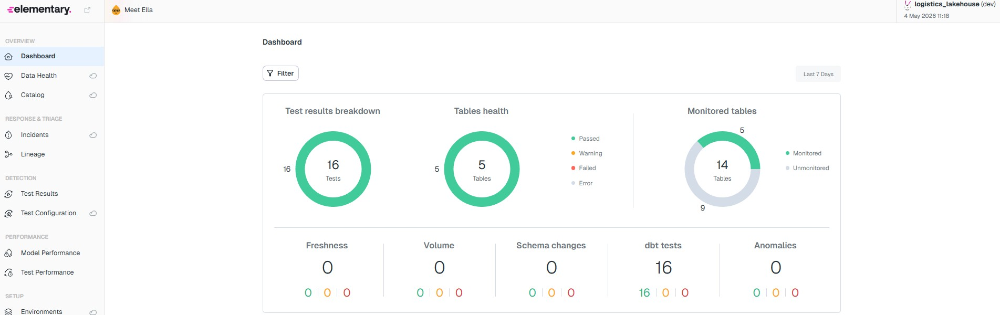

# Logistics Lakehouse Platform with CDC, Iceberg, dbt, Airflow, and Superset

       


Local operating view of the simulator that drives the CDC, telemetry, and analytics workload.

## Executive Summary

This project is a production-style local data platform for logistics analytics. It simulates a delivery operation, captures operational changes and telemetry through CDC, persists them into an Iceberg lakehouse, transforms them with dbt, orchestrates them with Airflow, monitors them with Elementary, and serves them through Superset.

It is designed to demonstrate architecture and delivery skills that matter in data engineering interviews and technical evaluations:
- building a CDC-driven lakehouse instead of a static demo pipeline,
- handling historical retention and replay in a local environment,
- orchestrating Bronze, Silver, and Gold transformations with observable quality controls,
- publishing analytical assets that connect model design to business-facing KPIs.

## Key Skills Demonstrated

- CDC ingestion design with Debezium, Kafka, Trino, and dbt
- Iceberg-based medallion modeling across Raw, Staging, Silver, and Gold
- Recovery-oriented platform design for ephemeral local infrastructure
- Data quality and lineage with dbt tests and Elementary Data
- Airflow orchestration using Astronomer Cosmos task groups
- BI delivery with curated Superset datasets, charts, and dashboards

## Architecture and Design Choices



This platform uses a pull-based CDC architecture:
1. The Logistics Operations Command writes operational events into PostgreSQL.
2. Debezium captures row-level changes and publishes them into Kafka topics.
3. Trino exposes those live Kafka topics as queryable sources.
4. dbt pulls that stream into persistent Iceberg Raw tables, then promotes it through Staging, Silver, and Gold layers.
5. Airflow orchestrates ingestion and analytics DAGs, while Elementary provides quality and lineage visibility.
6. Superset consumes the Gold layer through imported analytical assets.

The most important architectural decision is the pull-based landing step. Instead of pushing events directly from Kafka into the lake with a sink-based ingestion path, dbt persists the stream into Iceberg Raw tables. That makes the lakehouse more auditable, easier to replay, and less dependent on short-lived topic state.

## Data Engineering Highlights

### 1. Persistent Raw Retention over Live-Only Streaming

The Raw layer is treated as the durable landing zone for CDC data. Kafka remains the transport layer, but Iceberg becomes the analytical source of truth. This gives the platform:
- historical retention beyond transient topic behavior,
- repeatable downstream rebuilds,
- cleaner debugging when Silver or Gold logic changes.

### 2. Offset-Based Idempotent Raw Ingestion

The Raw ingestion models track Kafka partition offsets (`_partition_id`, `_partition_offset`) instead of relying only on timestamps. This makes the landing step idempotent and reduces the risk of missed or duplicated events when high-frequency messages share similar timestamps.

### 3. Automated Recovery for Local Infrastructure Resets

The local platform is designed to recover from common ephemeral-environment failures, especially when LocalStack state is reset while the Iceberg catalog still retains metadata. The `lakehouse-setup` recovery flow:
- detects local environment resets,
- removes orphaned Iceberg metadata from the JDBC catalog,
- recreates buckets and schemas,
- triggers dbt and Elementary repair flows after infrastructure recovery.

### 4. Historical Recovery Guardrails

The streaming layer is configured so historical data can be rebuilt after resets:
- the Debezium source connector can republish a fresh source snapshot on restart,
- Bronze staging models use null-safe incremental watermarks,
- the lakehouse can be repopulated without manual row-by-row intervention when empty targets must be rebuilt.

### 5. Trino and Iceberg Compatibility Adaptation

The Trino Iceberg JDBC catalog does not natively behave the way dbt and Elementary expect for some temporary relation patterns. This project uses local macro overrides to keep dbt and observability workflows compatible without forking upstream packages.

## The Logistics Operations Command

The source workload is not static seed data. It is a Python simulation engine that generates realistic operational pressure on the platform:
- order lifecycle state transitions,
- high-frequency fleet telemetry,
- dispatch, collection, and delivery timestamps,
- district-to-district movement patterns.

This matters because it turns the lakehouse into a realistic systems exercise rather than a modeling-only project. The simulator creates the kinds of late-arriving updates, replay scenarios, and telemetry density that make CDC, staging, and KPI modeling meaningful.


## Analytics and Observability Evidence

The Gold layer is built to answer concrete logistics questions:
- **On-Time Delivery:** Which districts are meeting service targets, and how stable is delivery performance over time?
- **Fleet Efficiency:** How intensively is each truck being used relative to its observed active window, and where is work concentrated?
- **District Corridors:** Which origin-destination routes carry the most volume, longest durations, and weakest OTD performance?

### Airflow DAG Assets

#### Bronze Ingestion DAG



This DAG (`dag_lakehouse_bronze`) owns the ingestion boundary between Kafka and the lakehouse. It materializes Raw and Staging models for orders, trucks, and telemetry, then runs `elementary_sync` so metadata and observability artifacts stay aligned with each ingestion cycle.

#### Analytics Transformation DAG



This DAG (`dag_lakehouse_analytics`) owns the serving layer. It executes the Silver and Gold transformations behind `order_trips`, `truck_activity`, `otd`, `district_heatmap`, and `fleet_utilization`, with validation steps that reinforce trust in the KPI layer exposed to BI consumers.

### Superset Dashboard Assets



This dashboard demonstrates the fleet-serving layer: utilization index trends, distance patterns, and empty-running behavior derived from the truck activity and fleet utilization models.



This dashboard demonstrates the delivery-performance layer: district-level OTD, trend analysis, delivery classification tiers, and corridor-level operational behavior from the Gold OTD and heatmap models.

### Elementary Observability Assets

#### Lineage View



This lineage view shows the dependency path from Raw ingestion through Staging and into the Gold analytical layer. It makes the medallion architecture explicit and supports impact analysis across the KPI stack.

#### Data Quality Dashboard



This dashboard shows test execution coverage, monitored tables, freshness, and overall transformation health. It provides the operational quality layer behind the analytical outputs, not just the visualized metrics themselves.

## Repository Map

```text
source_system/   Source simulator, Streamlit operational UI, PostgreSQL source stack
streaming/       Kafka, Kafka Connect, Debezium connectors, connector registration scripts
infra/           Airflow, Trino, LocalStack, Elementary, catalog, recovery services
dbt_project/     Raw, Staging, Silver, and Gold transformation logic
superset/        Imported datasets, charts, dashboards, and BI bootstrap assets
implementations/ Technical context and architecture record
```

## Quick Execution Guide

### Requirements

- Docker and Docker Compose
- Enough local resources to run PostgreSQL, Kafka, Trino, Airflow, Elementary, and Superset together
- `.env` files created from the provided `.env.example` templates

### 1. Prepare Environment Files

Create local `.env` files from the examples:

**Linux/macOS**
```bash
cp source_system/.env.example source_system/.env
cp streaming/.env.example streaming/.env
cp infra/.env.example infra/.env
cp superset/.env.example superset/.env
```

**Windows (PowerShell)**
```powershell
Copy-Item source_system\.env.example source_system\.env
Copy-Item streaming\.env.example streaming\.env
Copy-Item infra\.env.example infra\.env
Copy-Item superset\.env.example superset\.env
```

### 2. Start Services in This Order

The startup order matters because Kafka Connect, Airflow, and Superset depend on other layers being ready.

1. Start the source system:
```bash
docker-compose -f source_system/docker-compose.yaml up -d --build
```

2. Start the lakehouse infrastructure:
```bash
docker-compose -f infra/docker-compose.yaml up -d --build
```

3. Start the streaming stack:
```bash
docker-compose -f streaming/docker-compose.yaml up -d
```

4. Wait for Kafka Connect to become healthy, then register the connectors:
- **Linux/macOS:** `./streaming/register_connectors.sh`
- **Windows:** `.\streaming\register_connectors.ps1`

5. Start Superset:
```bash
docker-compose -f superset/docker-compose.yml up -d --build
```

### 3. Trigger the Data Pipelines

Once Airflow is healthy, access `http://localhost:8081` using the credentials configured in `infra/.env`.

For the first run or a manual demo refresh:
1. Trigger `dag_lakehouse_bronze`
2. Trigger `dag_lakehouse_analytics`

### 4. Access the Analytical Layer

- Streamlit operational UI: `http://localhost:8501`
- Trino UI: `http://localhost:8080`
- Airflow UI: `http://localhost:8081`
- Elementary UI: `http://localhost:8082`
- Superset UI: `http://localhost:8088`

Use the credentials configured in the corresponding `.env` files rather than hardcoded defaults.

## Operational Notes

- Give Kafka Connect roughly a minute to initialize before registering connectors.
- Airflow, Elementary, and Superset can take a few minutes to become fully ready after container startup.
- The connector registration flow templates the Debezium source credentials from `streaming/.env`, so those values must match the source system configuration.
- The optional S3 sink connector files remain in the repository as supporting artifacts, but the primary analytical path in this project is the pull-based CDC flow into Iceberg Raw tables.

## Known Tradeoffs and Future Improvements

- The platform is optimized for local demonstration and technical evaluation rather than multi-user production deployment.
- Some recovery and historical rebuild behaviors are intentionally surfaced because local ephemeral infrastructure is part of the engineering challenge being demonstrated.
- Access control, secrets management, deployment automation, and production-grade observability could be extended further in a cloud deployment variant.
- Fleet utilization is currently modeled from trip duration over observed active telemetry hours; a production implementation could extend this with richer utilization business rules and operating thresholds.
